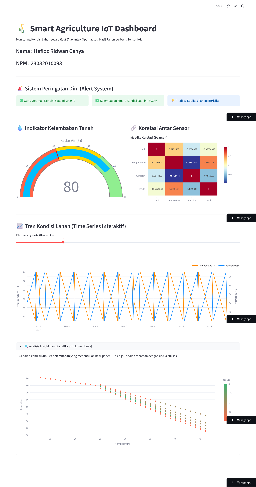

# 🌾 Smart Agriculture IoT Dashboard - Data Lifecycle Management

Nama : Hafidz Ridwan Cahya
NPM : 23082010093

Repositori ini merupakan implementasi *end-to-end* **Data Lifecycle Management** untuk menganalisis data sensor IoT pada lahan pertanian, mulai dari akuisisi data mentah hingga visualisasi *dashboard* interaktif. Proyek ini disusun untuk memenuhi Tugas 2 Mata Kuliah Big Data dan IOT.



## 📌 Deskripsi Dataset
Data set ini berisi 16.411 catatan data terkait tanaman, yang berfokus pada kondisi lingkungan kunci dan dampaknya terhadap tahap pertumbuhan tanaman. Data set ini mencakup informasi seperti:
- Jenis tanah (`soil_type`)
- Tahap pertumbuhan bibit (`seedling_stage`)
- Indeks kelembaban (`MOI`)
- Suhu (`temperature`)
- Kelembaban (`humidity`)
- Hasil panen / kelayakan (`result`)

Setiap baris mewakili sampel tanaman unik beserta faktor lingkungan yang terkait, yang dapat digunakan untuk pemodelan *machine learning* dalam memprediksi kesehatan tanaman atau kebutuhan irigasi.

---

## 📂 Struktur Repositori
```text
data-lifecycle-smart-farming-23082010093/
├── README.md                                 # Dokumentasi utama
├── data/
│   └── raw/
│       └── smart_agriculture_dataset.csv     # Data mentah dari Kaggle
├── Data_Lifecycle_Smart_Agriculture.ipynb    # Notebook utama (EDA, Cleaning, & Analisis)
├── dashboard/
│   └── streamlit_app.py                      # Source code aplikasi Streamlit
└── outputs/
    ├── cleaned_data.csv                      # Data bersih hasil pemrosesan
    ├── analysis_report.pdf                   # Laporan analisis (PDF)
    └── dashboard_screenshot.png              # Bukti visualisasi dashboard